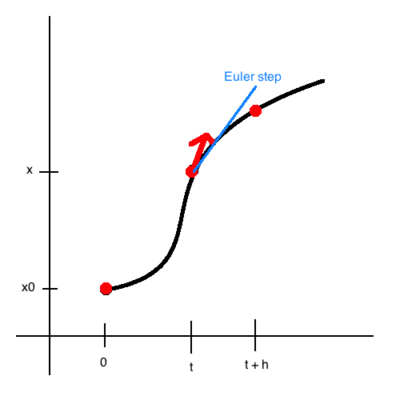

# Animation by Numeric Integration

Solving differencial equation:

```
x' = f(t,x)
```

where `x(t)` is position.

Need to define time steps, which are small enough to yeild realistic-seeming transitions. Also can use _adaptive time steps_ to algorithmically decide appropriate time step based on how `x(t)` acts.



### MidpointMethod

Several evaluations (sampling of `f`). Compute:

```
F1 = h f(t, x)
F2 = h f(t, x + F.1)
```

Assume `x(t)` is twice differenciable.

```
x(t + h) = x(t) + h x'(t) + (1/2) h^2 x''(t)        + O(h^3)
         = x    + h f     + (1/2) h^2 (f't + f f'x) + O(h^3)

let
    F2 = h f(t + ah, x + b F1) // F1 = h f
       = h [f + (a h f't) + (b h f f'x) + O(h^2)]
in
    x' = x + w1 F1 + w2 F
    x' = x + w1 h f + w2 h [f + (a h f't) + (b h f f'x) + O(h^2)]

let
    w1 + w2 = 1,
    and w2 a = w2 b = 1/2


finally, 4th order R-K ... analysis gives O(h^5) error per step

F1 = h f(t,x)
F2 = h f(t + h/2, x + F1/2)
F3 = h f(t + h/2, x + F2/2)
F4 = h f(t + h  , x + F3)
x' = x + (1/6) (F1 + 2 F2 + 2 F3 + F4)

```