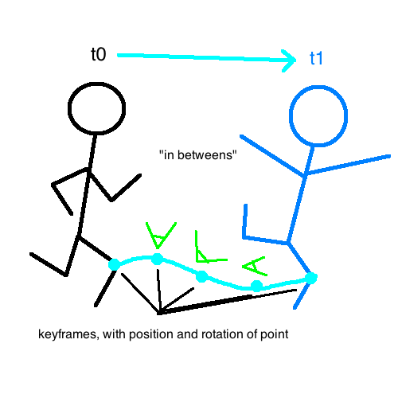
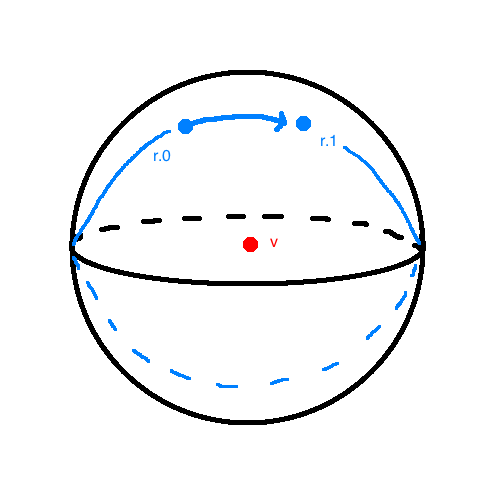

# Animation

## Interpolation of Position



Can interpolate position normally with curves. But what about rotations?

## Interpolation of Rotation

*Wrong*: `R(t) = (1-t) R.0 + t R.1`. This will not result in a rotation matrix, generally :(

*Solution*: Quaternions



## Physical Systems

###  Particle Systems; Spring and Mass Systems

1. Generalized gravity / electromagnetism
2. Hooke's law for springs

For just a single particle (point mass)

```
t = time variable

// a point mass
m = mass
P(t) = position             // point
P'(t) = velocity            // vector
P''(t) = acceleration       // vector

// forces on point mass
F = sum([ F.i for i=1..n ]) // vectors

// Newton's second law (at a time t)
F = m P''(t)
```

For a system of particles

```
// particles
S(t) = { P.1(t) , ... , P.n(t) } // system of bodies
P.i(t) = point i's position at t

// force in system
F = calculated from S(t) and P(t) // time appears indirectly
```

Easy calculation: Euler's method.

```
// setup
x(t) // 1D position
x(0), v(0) := x0, v0 // initial conditions

// step through time
h = ∆t // time step
x(i) = x(t + ih)
v(i) = v(t + ih)

// acceleration (differencial equation)
a(i) = F(x.i, v.i) / m

// Taylor approximation
// O(h) term is negligable for small h
v(t) approx= ( x(t + h) - x(t) ) / h + O(h)
v(t) approx= x(t)+ hv(t)
```

