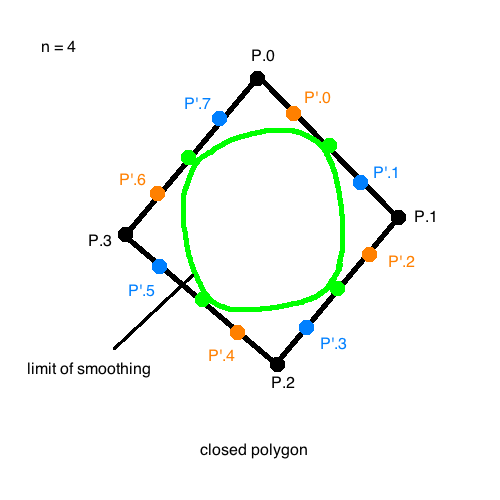
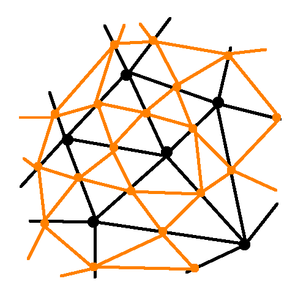
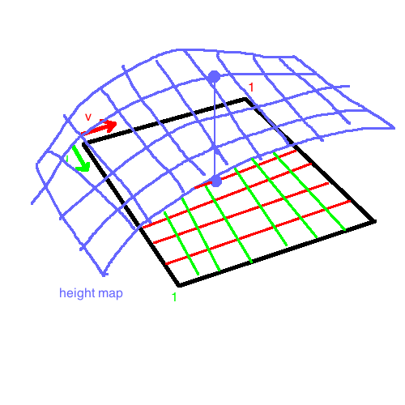
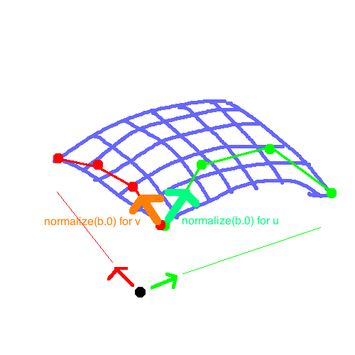
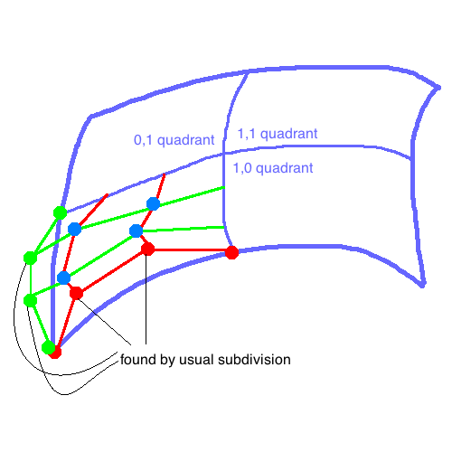

# B-Spline Subdivision Curves

## Chaikin's subdivision scheme

Applying *averaging mask* (convex combinations)

```
P.0, P.1, ..., P.(n-1)     // input n points
P'.0, P'.1, ..., P'.(2n-1) // results 2n points

where:

P'.(2i)   := (3/4)P'.i     + (1/4)P'.(i+1)
P'.(2i-1) := (3/4)P'.(i-1) + (1/4)P'.i
```



The limit smoothing turns out to be piecewise quadratic. It is actually the same as the bspline smoothing from before, but piecewise. Can view the Chaikin scheme as:

1. Split at midpoints
2. Apply averagive mask at "older" points: `(1/2,1/2) <- mask`

## Subdivision Surfaces _(teaser)_



Edges will be drawn inward with each smoothing step, to eventually make a closed surface.

### Example:

Bezier suface path

```
S(u,v) = sum([P.i.j b.i(u) b.j(v) for j in 0..k for i in 0..k])

u,v in [0,1]^2
```



A neat property is that at the corners, the normals of the `b.0`'s for `v` and `u` span a tangent space to that corner, and cross to make the normal at the corner.



## Subividing a Surface



But this method seems to be very limited.