# B-Splines

## Piecewise Bezier Curves

_Recall:_ subdivision process for quadratic bezier.

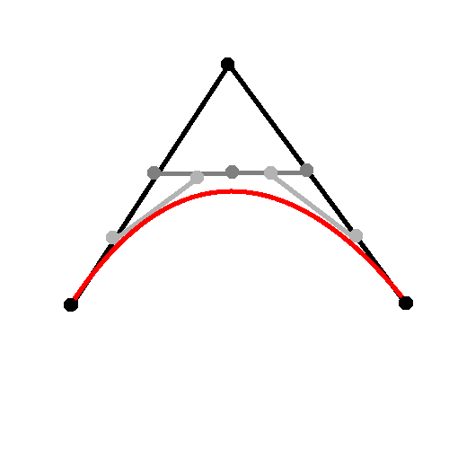

The goal is to approximate a control polygon with smoothly varying curve. But a problem with Bezier solution is non-control ⟹ every point (except end points) has influence over entire curve, so it's hard to work with to fine tune local sections.

## Quadratic Beziers

So instead we stitch together a series of Bezier curves (quadratic Bezier pieces). This results in local controls over the curves, and two degrees of continuity:

- `C^0` : line is cont.
- `C^1` : first derivatives
- `G^1` : instead of `C^1`, can have geometric continuity, `seg.(n+1)'(1) = k seg.n'(0)`

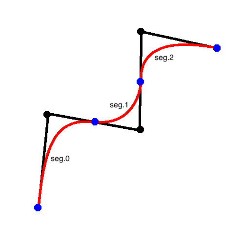

## Cubic Beziers

Can also have cubic Bezier spline, where the black dots are the original control polygon, and the blue arrows are tangent vectors that define the rest of the points of the cubic Bezier control polygon:

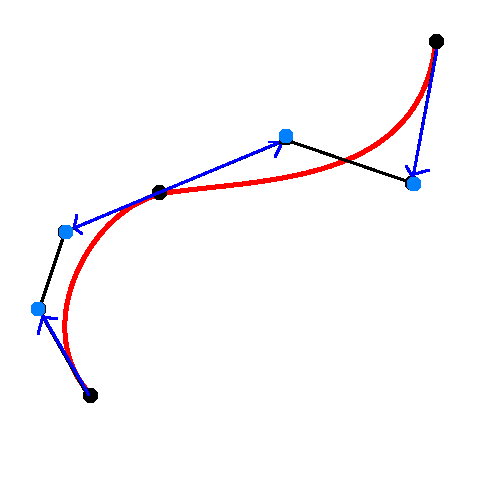

## Family of Curves

B-splines of order `k = 2,3,...`. 

```
Q(u) = sum([ b.i(u) P.i for i=1..n ]) where
b.i(u) = b(u - i)
```

# B-Spline Basis Functions

The `b(u)` is the B-spline basis functions for a given `k`. It is a piecewise polynomial over the "knot" intervals. Example of `k = 4`, where the red points are knot points:

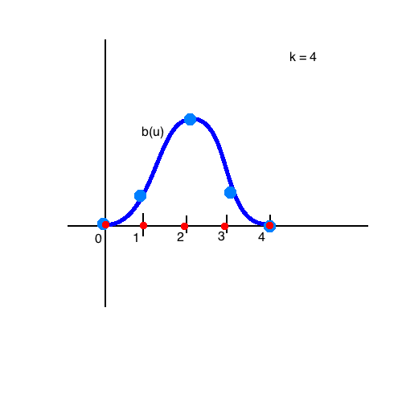

- degree of polynomial segments is `k - 1`.
- `C^(k-2)` continuity at knot points (where segments meet).

B-spline basis functions for `k = 2`:

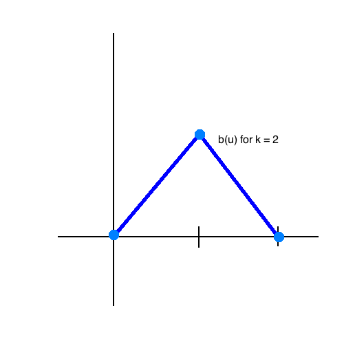

B-spline basis functions for `k = 3`:

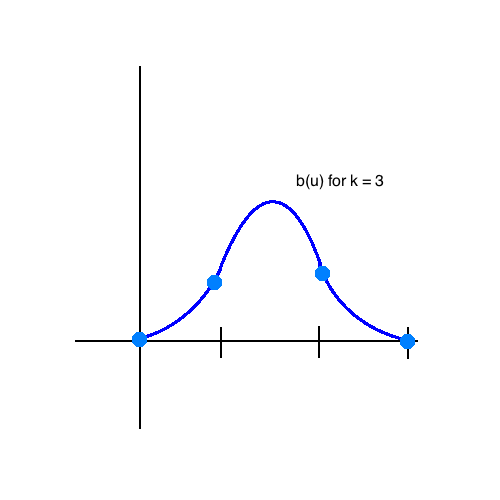

Each of these basis functions are piecewise of `k` parts, and gets smoother and smoother as you increase `k`.

Applying to control polygon with linear basis functions:

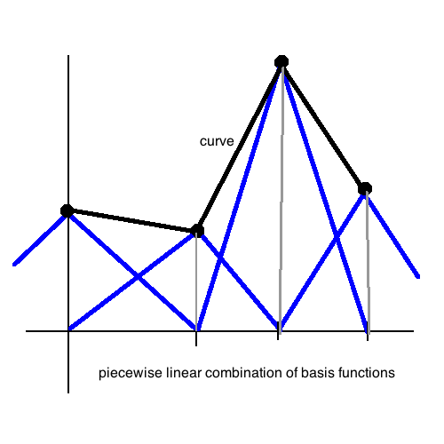

Applying to control polyogn with quadratic bassi functions:

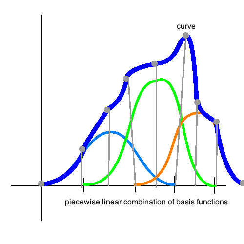

However, setup of `c(t) = sum([ b(t-i) p.i for i=0..(n-1) ])` is illegal since you can't really sum points. So this only works if it's an _affine combination_. And, it turns out that we can have it such, since

```
all([ sum([ p.i(t) for i=1..k ]) == 1 for t in [0,1] ]).
```


So the ultimate process is solvign for the polynomial coefficients of each peice:

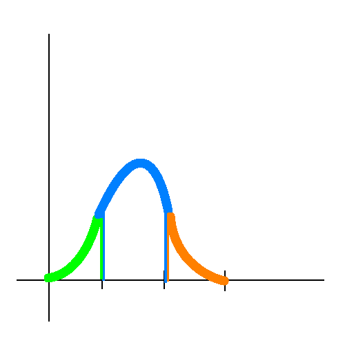


You also get this, from the affine property:

```
∫ b(t)dt = 1.
```

You can think of a type of inner product in the space of functions:

```
<f,g> = ∫ f(t)g(t)dt
```

`g(t)` is `sum([ u.i v.i for i=1..n ]).` _Normalizing:_ unit area functions, `∫ f(t)dt = 1`.

### Convolution

Define the convolution of `f` with `g` as

```
(f * g)(s) = ∫ f(t) g(s-t) dt.
```

where `g(s-t)` is the analysis filter of `g`, and `s` is arbitrary. Then what this does is reflects and translates `g` like so:

| 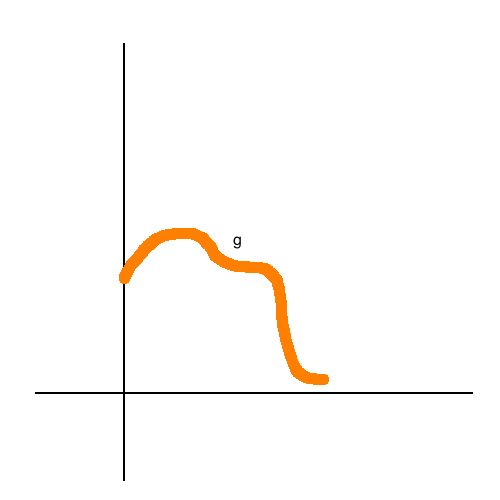 | ----> | 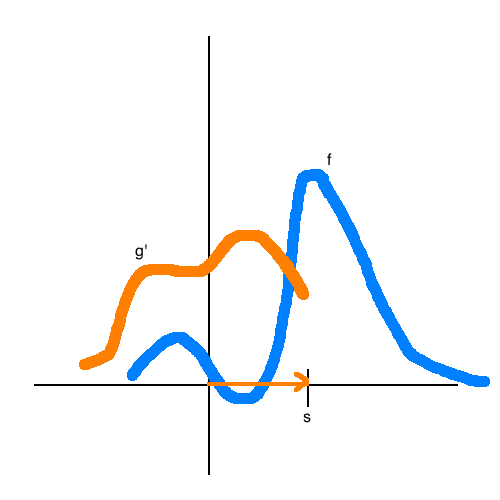 |
|---|---|---|


*Fact:* `∫ (g*f)(t)dt = ∫ f(t)dt` if `g` unit area. Integral is preserved.

For example, define `k = 1` B-spline basis function

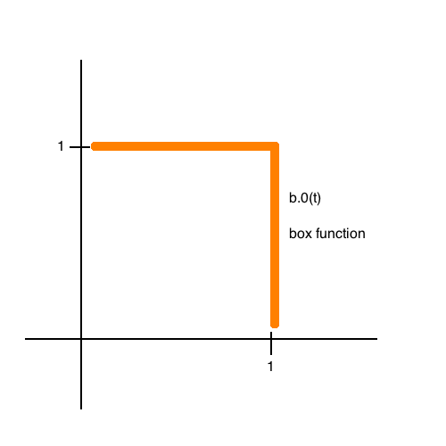

```
b.(i+1)(t) = (b.i * b.0)(t) // basis functions
```