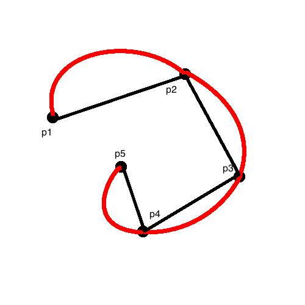
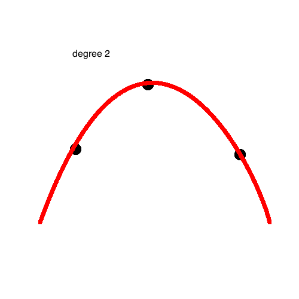
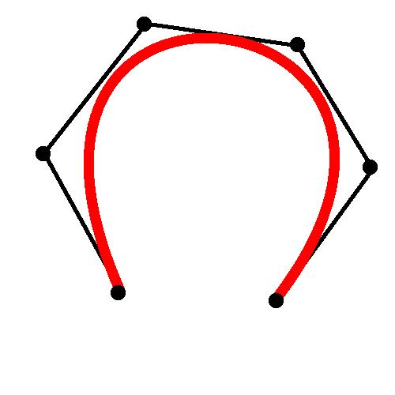
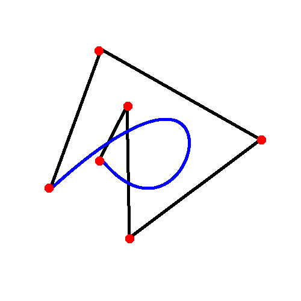
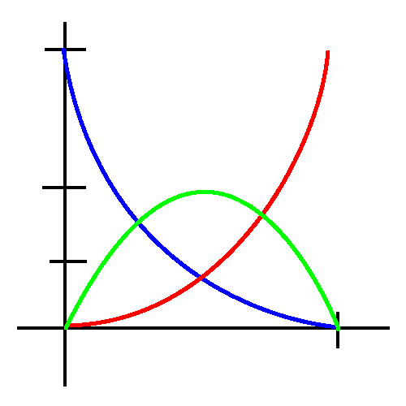
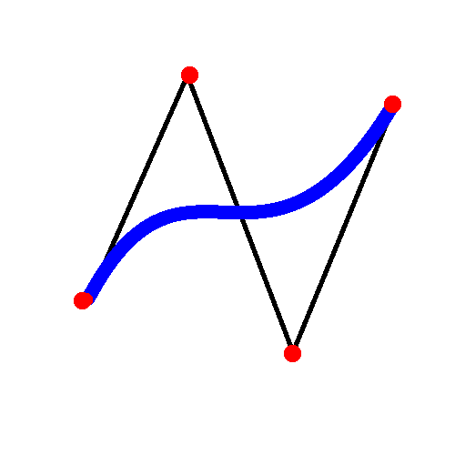
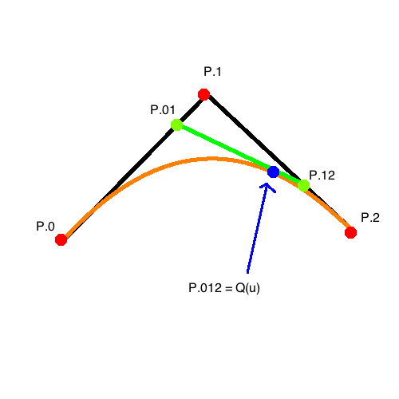
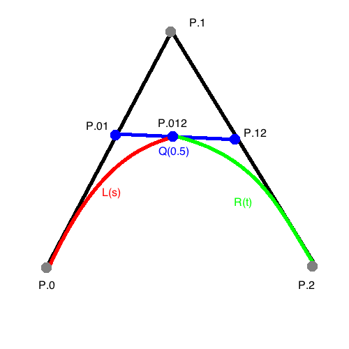

# Curves

_Idea_: Have series of points `(P.0, P.2, ... , P.n)` that make line segments. 



These will be the control points of the control open-polygon, and then to make a curve we can

- approximate the control polygon
- interpolate between the points along a curve

Some applications:

- render borders of smooth objects
- animate "tweens"
- approximation of data (compression) and other numeric methods

## Goal:

Polynomial curve `Q(u) = (x(u), y(u))` where `x(u), y(u)` are degree n polynomials. Then set `Q(i) = P.i`, so the polynomial "interpolates `P.i`". Also, `P.i = (x.i, y.i)`.

w.i(u) = "weight" or contribution of i-th control, where we want `w.i(u) = 1 if u==i else 0`. So then

```
x(u) = sum([ prod([ u-j for j!=i ]) / prod([ i-j for j!=i ]) * x.i for i=1..n ])
```

And theree is a similar polynomial for `y(u)`.

For example, if you just have `Q : [0,1] -> R^2`, and you just have `n=1`, then `Q(u) = (1-u)*P.1 + u*P.1`, which is a straight line (degree 1). Guess what it is for `n=2`.



## Bezier Curves

- degree n polynomials
- interpolate endpoints `P.0` and `P.n`
- "approximate" the control polygon
- compute convex combination of `P.0, ..., P.n`

The result is a curve that won't cross the control polygon very much. Hase a "convex hull" property.






What you can do is use small `n` curves as components of larger curve -> piecewise curves. There are `n+1` control points on the control polygon.

```
Q(u) = sum([ b.i(u)*P.i for i=0..n ])
```

where `b.i` is the i-th *blending function* (Bernstein polynomials of degree `n`). They are non-zero on `[0,1]`.

_Goal_:

```
sum([ b.i(u) for i=0..n ]) = 1
```

for each `u`.

_Trick_: `1 = 1^n = ((1-u)+u)^n = sum([ choose(n,i)*(1-u)^(n-1)*u^i for i=0..n ])`, so just use this to set equal to `sum([ b.i(u) for i=0..n ])`!

This is a convex combination. This is an affine combination, so `A * P.i ->` control polygon of `A(Q(u))`, where `A` is an affine transformation. 

Additionally, `line(P.0,P.1)` and `line(P.(n-1),P.n)` make tangent lines

### Crossing property:

```
n = 1,
Q(u) = (1-u) P.0 + u P.1
```

```
n = 2,
b.0(u) = (1-u)^2    // blue
b.1(u) = 2 u (1-u)  // yellow
b.2(u) = u^2        // red
```



Crossing Example:



Now, evaluating a quadratic Bezier at `u`:

```
P.01  = (1-u) P.0 + u P.1
P.12  = (1-u) P.1 + u P.2
P.012 = (1-u) P.01 + u P.12
      = (1-u) ((1-u) P.0 + u P.1) + u ((1-u) P.1 + u P.2)
      = (1-u)^2 P.0 + 2u (1-u) P.1 + u^2 P.2
      = Q(u)
```



So P.012 is a point on the curve of `Q`. Then can use thsis as a new control polygon: `poly(P.0, P.012, P.1`. The above is called de'Casteljau's algorithm for evaluating at `u`. With `n > 2` can just iterate more along more control points.

### Tangent Property

```
D(B.0)(u) = -n (1-u)^(n-1)
D(B.1)(u) = -n (n-1) (1-u)^(n-2) u + n (1-u)^(n-1)

D(B.1)(0) =  n
D(B.0)(1) = -n
D(B.i)(0) =  0 // for all i=2..n

D(Q)(u) = n (P.1 - P.0) // vector
```

so the derivative of a point is a vector! Makes sense.

### Subdivision Scheme



`L` and `R` are also cubic curves

```
L(s) = Q(0.5 s)
R(t) = Q(0.5 + 0.5 t)
```

Turns out that the control polygon of `P.0, P.01, P.012` is `P.012, P.12, P.2`.

So an algorithm for drawing a Bezier could be:

```
...
```