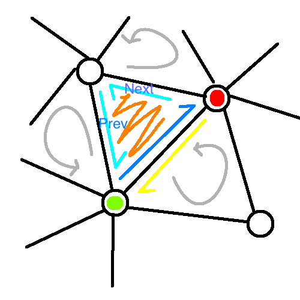
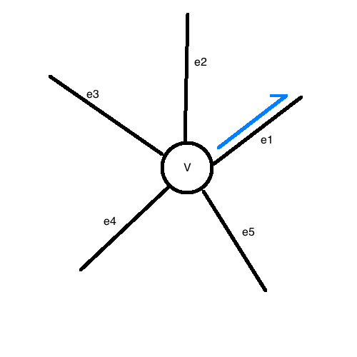

# Mesh Data Structures

There is *curve subdivision* and *mesh subdivision*. In order to make a good mesh, must not have a _soup of triangles_; there should be orientation and sensible neighborings of faces on the mesh.

_Hidden Agenda_: you should be really aware of link-based datastructures, e.g. linked lists, trees.

## Half-Edge Winged Data Structure

Objects are collections of vertices, edges\*, and facets (assume triangular for examples), where edges\* are 'half-edges': have orientation and direction.

This yields a domain for each 3D patch, where the edges of the triangles form basis vectors for moving along the facet (in an orientation-consistent way).

### Half Edge:

```
class HEdge {               // dark blue
    Vertex source, target;  // green, red
    HEdge twin;             // yellow
    Face face;              // orange
    HEdge next, prev;       // labeled
}
```



### Vertex:

```
class Vertex {
    Hedge out; // take care in choosing this!
    Point3 location;
}
```



some traversing:

```
    e1 = v.out;
    e2 = v.out.prev.twin;
    e3 = e2.prev.twin;
    ... // other edges

    v1 = e1.target;
    v2 = e2.target;
    v3 = e3.target;
    ... // other vertecies
```

### Face:

```
class Face {
    HEdge first; // take care in choosing this!
    // you can get everything else from this
}
```