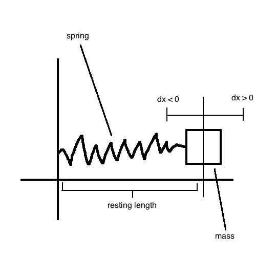
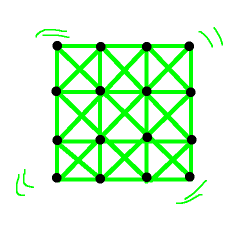
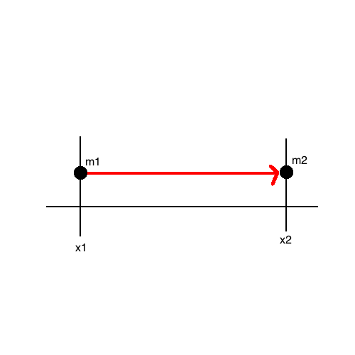

# Particle Systems

(i.e. Numerical integration of differential equations with respect to time)

Subject to forces:
- Flocking
- Spring and mass systems

## Setup

Generalize position that changes with time:
- for n-body system: `{ (x.1,y.1,z.1), ..., (x.n,y.n,z.n) }`.
- specification of system: `x(t)`

Initial value problem: `x(0) = x0` (initial position/state)

Find: `x(t.i)` at specific times `t.1, ..., t.m`. Typically choose `h = step`, to have `t.i = i h` (uniform step size).

Then the equations:
```
x'' = F(t, x(t)) / m   // differential equation (Newton's Second Law)

a.i = F(t.i, x.i)      // acceleration
v.(i+1) = v.i + h a.i  // velocity
x.(i+1) = x.i + h v.i  // position
```

## Hooke's Law



`F` is proportional to `dx`:

```
F(t, x(t)) = -k (x(t) - x0)) = -k dx
```

## Jell-O Simulation

- Black: particles
- Green: spring connection between particles



## Flocking

Forces without explicit connections, like how **gravity** works in the real world.

```
F = [ G (m1 m2) / |d12|^2 ] [ (x2 - x1) / |x2 - x1| ]
```



### Velocity Matching

Imagine there is a flock of birds, and they are trying to match each other's velocities.

```
// {i for i=1..k} are the neighbording birds within radius dc

w.i = if (d.i := |x-x.i| < dv)
        then w(d.i)
        else 0

// w(d) is proportional to 1/d

sum([ w.i v.i for i ]) / sum([w.i for i]) = v~

a = v~ - v

// compute a direction
fc = sum([ (x.i - x) / |x.i - x|^2 for i ]) / |k|
```