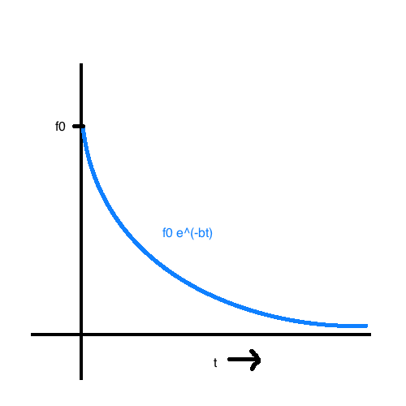
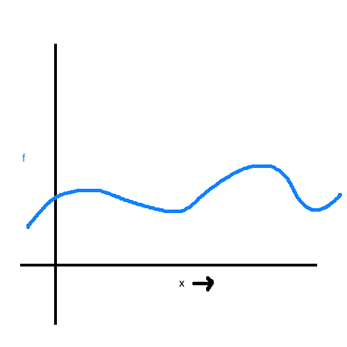
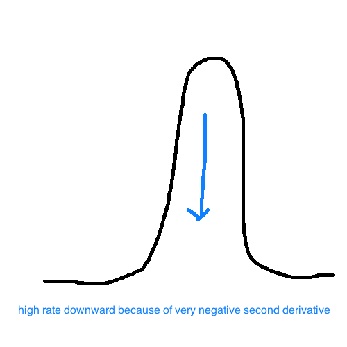
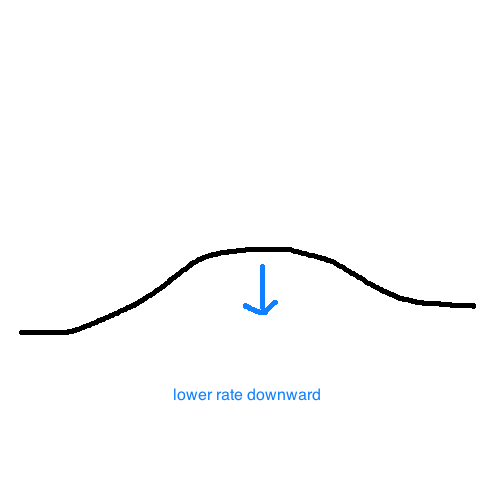

# Reaction Diffusion

System of `n` chemicals (usually have `n=2` for example purposes) distributed over the plane.

```
C.i(x,y,t) = concentration of chemical i at location (x,y) at time t
t : 0 -> ∞ = steady state (converge to same pattern)
```

Think of these as "morphoges" distributed within a tissue.

### Model several functors:

* **diffusion:** chemical moves from higher to lower concentration.

* **reaction:** interaction amongst the chemicals e.g. presence of chemical 1 and chemical #2 -> chemical #3.

* **dissipation/replenishment:** decay/injection (of the chemical throughout the substrate).

### Example papers:

- Turing
- Witkins & Kass
- Turks
- XMorphia
- Lawlor


## Witkins & Kass

```
C' = ∂C/∂t = a^2 ▽^2 C - bC + R(C.1, C.2, ... , C.n)
    where ▽^2 C = (∂^2 C / ∂ x^2) + (∂^2 C / ∂ y^2)
```

Solution: `f0 e^(-bt)`, `df/dt = -bf`.



Consider the 1D function, evolving over time



```
∂f/∂t = a^2 (∂^2 f / ∂^2 x^2)
```

which happens to be the heat dissipation along a rod!

### Example (Turing -> Turk -> Lawlor)

```
C' = a^2 ▽^2 C + p (g - C D)        // g is "growth"
D' = b^2 ▽^2 D + p (C D - (D+d))    // -(D+d) is "decay"
```

So there is conversion of chemical C to chemical D when they are copresent. So is like chemistry!

```
I     -> C   \
C + D -> 2D   } - different rates, and are not reversible
D     -> P   /

    where I = input
          P = inert product
```





### XMorphia (Greay-Scott model, Pearson classification)

```
C' = a^2 ▽^2 C - C D^2 + F (1 - C)  // F is "feed"
D' = b^2 ▽^2 D + C D^2 - D (F + K)  // K is "kill"
```

Toggle `F,K` around to make cool results!
Some cool examples:
    - [Xmorphia](http://mrob.com/pub/comp/xmorphia/)
    -  [Karl Sims](http://www.karlsims.com/rd.html)
    -  [WebGL Implmentation](https://bl.ocks.org/robinhouston/ed597847175cf692ecce)

### Conway's Game of Life

* [WebGL Implementation](http://xpl.github.io/life/)
* [WebGL with Colors!](https://xpl.github.io/expression/)