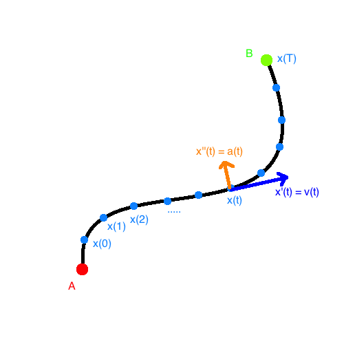

# Realistic Animation

This will be a kind of history of animation. Back in the 80's, there was a paper about how to make animations realistic and believable. It included these important points:

1. Squash and stretch

    Bodies move as if they had persistent volume and mass.

2. Timing

    Actions happen in sequence and start and stop at the right times.

3. Anticipation

    Telegraph next action at the right time, before the action.

4. Staging (early silent movie masters, e.g. Chaplin/Keaton)

    Positioning in order to make attention focus on the right things.

5. Follow through and overlapping action

    Actions 'start' a bit before the action, and build up to the action, then it happens, and then the action has a sort of 'follow through' that blends into their next action start.

6. Straight ahead action vs. pose-to-pose action

    Combine specific actions together with scene, rather than have seperate artist for specifics and scene.

7. Slow in and out

    Play with time to reflect our expectations.

8. Arcs (attention to gravity)

9. Exaggeration

    Play with positioning and time to visually exaggerate.

10. Secondary action

11. Appeal

    Want people to watch that are not just computer graphics nerds!


## Formable character

Is an optimization problem for movement that:

- is plausible / appears physically reliable
- can be explained by character's physical make-up/characteristics: musculuture, weight, measurements, resources, etc.
- suggest character's motivation: tired, eager, etc.
-  meet the scene's/character's goals.

Solving for these meets the 11 requirements specified before!

### Example: Luxo

(low-quality video) Demo of tool that allows real-time feedback from modifying parameters on the conditions for the optimization.

### Example: Rocket ship (particle)

Schedule of acceleration is due to force `F(t) = m a(t)`. Minimize:

```
∫( |F(t)|^2 dt for t=0,T ) = W // work
where
    // constraints
    x(t) = A
    x(t) = B
```



Using discrete time step `h`, can use finite differentiation:

```
x.i = x(i h)
v.i = (x.i - x.(i-1)) / h                 (1)
a.i = (x.(i+1) - 2 x.i + x.(i-1)) / h^2   (2)
```

Force constraint:

```
m x'' - F - m g = 0 // newtons
p.i = m a.i - F.i - m g = 0               (3)
```

Then, find
```
{ {p.i}, {F.i}, {x.i}, {v.i}, {a.i} }
for i = 1..n
```

that satisfy (1), (2), (3)  (SQP aka Sequencial Quadratic Programming) , and `x.0 = A, x.n = B`, that minimizes

```
h sum([ (F.i)^2 for i=0..n ]) // objective function, Reimann sum
```

by taking a walk along the solution space to a local minimum.