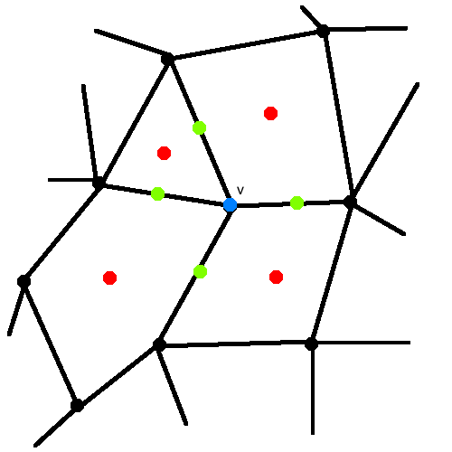
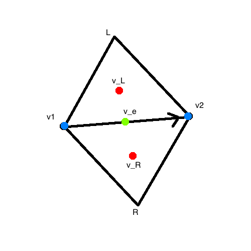
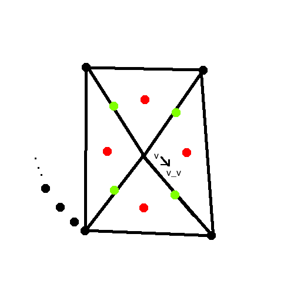
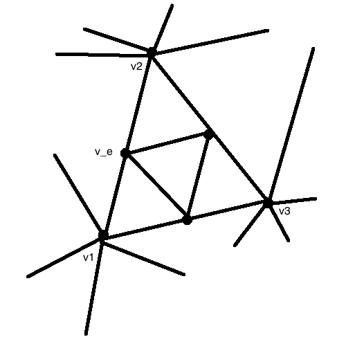
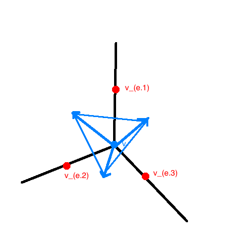

# Subdivision Surfaces

There's a problem with subdividing a surface using these rectangles, because its hard to deal with
- unusual _valences_ (degree of vertex) in mesh,
- stitching together rect patches while maintaining continuity at seams,
- animating, creases/meest get revealed.

### Attributes of Subdivision Surfaces
- Animator modelling more intuitive,
- Can handel arbitrary topology and valence,
- However, can cause too much smoothness.
    - _Solution_: hold some (_hard_) points/edges fixed while subdividing

### Subdivision Methods
- Doo-Sabin
- Catmull-Clark (_Gortler Ch. 22_)
- Loop
- Butterfly

## Catmull-Clark

This method is a generaliation of bicubic patches (see [B Spline Subdivision notes](B-Spline-Subdivision.html)).

- Handles "extraordinary valence" (degree = 4) vertices
- Continuity properties
    - `G^2` everywhere but
        - `C1` at extraordinary vertices
        - `C2` at normal vertices

Computing three types of "refinement" vertices:

```
refine v =>
| v_f (face vertices) // (red) introduced with subdivision step
| v_e (edge vertices) // (grn) introduced with subdivision step
| v_v (vert vertices) // (blu) presereved w/in mesh, new locations of v
```



The positions of `v_f, v_e, v_v` get comuted by the weighted averages.

_Example_:



`v_e = (1/4) (v_1 + v_2 + v_L + v_R)`

_Example_:



```
n = |N_v|
N_v = { u.1, ..., u.n } // edge vertices on "fan" surrounding vertex v
C_n = { w.1, ..., w.n } // face vertices centered on faces surround vertex v ("core")

v_v = (
    ((n-2)/n) v +
    (1/n^2) sum([ u for u in N_v ]) +
    (1/n^2) sum([ w for w in C.v ])
)
```

## Loop Subdivision

Invented by Charles Loop _(nothing to do with loops...)_.



```
v_e = (1/8) (v_L + 3 v1 + 3 v2 + v_R)
v_v = a.n v + ((1-a.n)/n) sum([ u for u in N_v ])
```


## Doo-Sabin

Generalization of biquadratic patches.

- `v_f` (face vertices)
- `v_e` (edge vertices)
- `v_v` (vert vertices)

```
v_f = 1/|V_f| • sum([ u for u in V_f ])
v_e = (1/2) v_1 + (1/2) v_2
v_v = (1/4) (v_f + v_(e.1) + v_(e.2) + ... + v) // corner cutting
```
(Surface analog to Chaikin curve)

